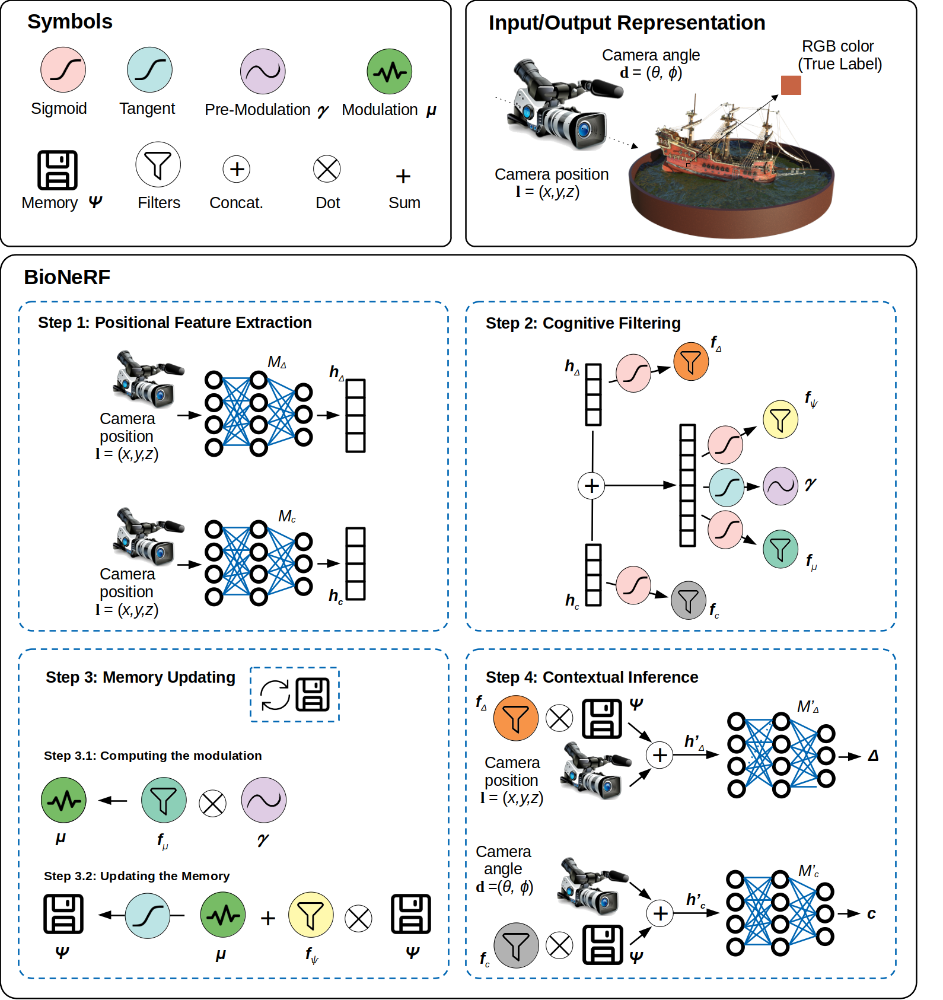

# BioNeRF

[BioNeRF](https://arxiv.org/pdf/2402.07310.pdf) (Biologically Plausible Neural Radiance Fields) extends [NeRF](http://www.matthewtancik.com/nerf) by implementing a cognitive-inspired mechanism that fuses inputs from multiple sources into a memory-like structure, thus improving the storing capacity and extracting more intrinsic and correlated information. BioNeRF also mimics a behavior observed in pyramidal cells concerning contextual information, in which the memory is provided as the context and combined with the inputs of two subsequent blocks of dense layers, one responsible for producing the volumetric densities and the other the colors used to render the novel view. The method outperformed recent approaches and achieves state-of-the-art results for synthesizing novel views of complex scenes. Here are some videos generated by this repository (pre-trained models are provided below):


Code release for:

> __BioNeRF: Eiologically Plausible Neural Radiance Fields__
>
> [Leandro A. Passos](https://orcid.org/0000-0003-3529-3109), Douglas Rodrigues, Danilo Jodas, Kelton A. P. Costa, [João Paulo Papa](https://papajpblog.wordpress.com/)

:newspaper: [Paper](https://arxiv.org/pdf/2402.07310.pdf)


[Integration with NerfStudio for easier visualization and development](https://github.com/Leandropassosjr/ns_bionerf)


This code is based on a PyTorch implementation of [NeRF](https://github.com/yenchenlin/nerf-pytorch).

## Installation

```
git clone https://github.com/Leandropassosjr/BioNeRF.git
cd BioNeRF
pip install -r requirements.txt
```

<details>
  <summary> Dependencies (click to expand) </summary>
  
  ## Dependencies
  - numpy
  - torch
  - torchvision
  - imageio
  - imageio
  - matplotlib
  - configargparse
  - tensorboard
  - tqdm
  - opencv-python
  - torchmetrics

  
The LLFF data loader requires ImageMagick.
  
</details>

## How To Run?


Download synthetic Blender and LLFF scenes from [here](https://drive.google.com/drive/folders/128yBriW1IG_3NJ5Rp7APSTZsJqdJdfc1). Place the downloaded dataset according to the following directory structure:
```
├── configs                                                                                                       
│   ├── ...                                                                                     
│                                                                                               
├── data                                                                                                                                                                                                       
│   ├── nerf_llff_data                                                                                                  
│   │   └── fern                                                                                                                             
│   │   └── flower  # downloaded llff dataset                                                                                  
│   │   └── horns   # downloaded llff dataset
|   |   └── ...
|   ├── nerf_synthetic
|   |   └── lego
|   |   └── ship    # downloaded synthetic dataset
|   |   └── ...
```


To train a 400x400 `ship` scene on BioNeRF:
```
python run_bionerf.py --config configs/ship.txt
```

After training you can find the following video at `logs/blender_paper_ship/blender_paper_ship_spiral_400000_rgb.mp4`.


---

To train BioNeRF on different datasets: 

```
python run_bionerf.py --config configs/{DATASET}.txt
```

replace `{DATASET}` with `trex` | `horns` | `flower` | `fortress` | `lego` | etc.

---

To test BioNeRF trained on different datasets: 

```
python run_bionerf.py --config configs/{DATASET}.txt --render_only --render_test --generate_samples
```

replace `{DATASET}` with `trex` | `horns` | `flower` | `fortress` | `lego` | etc.

### Pre-trained Models

You can download the pre-trained models [here](https://drive.google.com/drive/folders/1oOVRMq3EJ3q4pZcbeuoiCuh1zrdiRb85?usp=drive_link). Place the downloaded directory in `./logs` in order to test it later. See the following directory structure for an example:

```
├── logs 
│   ├── fern_test
│   ├── flower_test  # downloaded logs
│   ├── trex_test    # downloaded logs
```

## Method


Here is an overview pipeline for BioNeRF, we will walk through each component in this guide.

### Positional Feature Extraction
The first step consists of feeding two neural models simultaneously, namely $M_{\Delta}$ and $M_c$, with the camera positional information. The output of these models encodes the positional information from the input image. Although the input is the same, the neural models do not share weights and follow a different flow in the next steps.

### Cognitive Filtering
This step performs a series of operations, called \emph{filters}, that work on the embeddings coming from the previous step. There are four filters this step derives: density, color, memory, and modulation.

### Memory Updating
Updating the memory requires the implementation of a mechanism capable of obliterating trivial information, which is performed using the memory filter (Step 3.1 in Figure~\ref{f.bionerf}). Fist, one needs to compute a signal modulation **$\mu$**, for further introducing new experiences in the memory **$\Psi$** through the modulating variable **$\mu$** using a $\textit{tanh}$ function (Step 3.2 in the figure).

### Contextual Inference
This step is responsible for adding contextual information to BioNeRF. Two new embeddings are generate, i.e., **${h}^{\prime}_\Delta$** and **${h}^{\prime}_c$** based on density and color filters, respectively (Step 4 in the figure), which further feed two neural models, i.e., $M^\prime_\Delta$ and $M^{\prime}$. Subsequently, $M^{\prime}_\Delta$ outputs the volume density, while color information is predicted by $M^{\prime}_c$, further used to compute the final predicted pixel information and the loss function.

## Citation
```
@article{passos2024bionerf,
  title={BioNeRF: Biologically Plausible Neural Radiance Fields for View Synthesis},
  author={Passos, Leandro A and Rodrigues, Douglas and Jodas, Danilo and Costa, Kelton AP and Papa, Jo{\~a}o Paulo},
  journal={arXiv preprint arXiv:2402.07310},
  year={2024}
}
```

